# controlled_lowdim_v1：15 个受控低维对象的代表轨线图

## 目标与范围

本报告为 `controlled_lowdim_v1` 的 15 个规范数据对象各绘制两张 clean-view 示意图：一张物理状态图与一张控制信号图，共 30 张图。图形用于核查轨线的时间尺度、物理状态分量与保存的控制字段，不用于模型训练、预测性能评估或跨对象的聚合评分。

绘图遵循 `docs/notes/mathematical explanation/controlled_lowdim_v1.md` 的 KSF-D1 数据契约；DUF-HF 的 BIL 方程、加权频带与物理验收由用户提供的 `D:\MyVault\Document\Obsidian\Notebook\草稿本\草稿3.md` 覆盖修订。v3 在此基础上加入连续时间窗验收，专门排除中间段近似直线的轨线。报告只读取每个对象的 `clean.jld2`，因此图中反映的是原始物理坐标。

## 数据与绘图约定

- 数据源：`data/releases/controlled_lowdim_v1`，正式 release，15 个 clean 对象均通过 release manifest 验证。
- 代表轨线：原有 12 个对象使用 `trajectory_id = 1`。DUF-HF 三个角色统一使用 `trajectory_id = 280`；它同时通过首尾持续性与连续时间窗门槛，并最接近合格轨线的中位最弱窗比。三个角色仍共享同一 matched key，保持初始物理状态与外部源初值可配对。
- 状态图：读取 `state_physical_clean`。线性振子、两个 Duffing 底座与 Van der Pol 的两个通道分别为 $x$ 与 $p$；单摆的两个通道为 raw angle $\theta$ 与 angular velocity $\omega$。
- 控制图：原有四个动力学底座读取左端点控制 `control_left_clean`。DUF-HF 的 AUG/ADD 显示物理外力 `forcing_additive_physical`，BIL 显示单位峰值 `source_signal_unit_peak`；三者都在 `time_transition` 上绘制。
- 时间轴：原有四个底座使用 $\tau=0.01$、状态 2,001 点 $[0,20]$ 与控制 2,000 点 $[0,19.99]$。DUF-HF 使用 500 Hz 模型网格（$\tau=0.002$），按 half-open 端点策略保存状态 2,000 点 $[0,3.998]$ 与控制 1,999 点 $[0,3.996]$。数学说明将 DUF-HF 的频率明确为 Hz，因此其图的时间坐标以秒解释；其余对象未声明物理单位，仍标为 `Time t`。

## 生成与验证协议

每个对象的状态图包含上下两个子图，分别显示两个物理状态分量在完整状态时间网格上的值。控制图显示完整控制区间网格上的 $c_m^{\mathrm L}$。脚本在保存前检查：状态维度为 2、状态与时间轴长度一致、控制与转移时间轴长度一致，并确认所绘数据全为有限值。

本次生成结果：15 个对象均输出 1 张状态图与 1 张控制图。每张图均使用对象对应的完整保存网格；各对象的精确样本数、起止时间与数值范围见下表。

DUF-HF v3 采用冻结正式 profile：$m=1$、$d=40$、$k=3000$、$k_c=5\times10^8$、加性外力峰值 $A_{\mathrm{HF}}=20$、双线性相对刚度深度 $\rho_k=12$。共同 source 的频率为 `5, 7.5, 9, 12, 16, 17.5, 20, 25, 30, 35, 40, 50, 60, 65, 70, 80` Hz，并对 9 Hz 与 17.5 Hz 赋权 2，其余谐波赋权 1，随后执行全局单位峰值归一化。高保真仿真采样率为 2,000 Hz，再以零相位 FIR 抗混叠后降至 500 Hz；AUG 和 ADD 共享物理母轨线，BIL 单独采用强刚度调制。512/128/128 个 train/val/test 轨线的 clean release 已重新生成；可选 10 dB 观测视图按当前配置关闭。

## DUF-HF BIL v3 连续性优化与调整记录

修订后的纯 BIL 方程为

$$
\dot x=p,\qquad
m\dot p=-dp-k[1-\rho_k c_{\mathrm{HF}}(t)]x-k_cx^3.
$$

该分支没有加性外力；当 $1-\rho_k c_{\mathrm{HF}}(t)<0$ 时，原点暂时失稳，而正的三次硬化项继续约束大位移。v3 正式数据中的瞬时线性刚度范围为 `[-33000, 35636.7]`，负刚度样本比例为 0.383779。

v2 的首尾持续性指标只比较前 1 s 与后 1 s，无法发现中间局部衰减。对 v2 全量 768 条轨线补算 0.5 s 窗、0.1 s 步长后，连续窗通过率仅为 0.373698，中位最弱窗相对 RMS 仅为 0.0597677；这解释了代表轨线中间段近似直线的现象。

令第 $\ell$ 个 0.5 s 窗的状态 RMS 为

$$
R_{i,\ell}=\left[\frac{1}{|\mathcal W_\ell|}\sum_{m\in\mathcal W_\ell}\left(x_{i,m}^2+p_{i,m}^2\right)\right]^{1/2},\qquad
\Gamma_{i,\mathrm{win}}=\frac{\min_\ell R_{i,\ell}}{\operatorname{median}_\ell R_{i,\ell}+\epsilon}.
$$

v3 要求 $\Gamma_{i,\mathrm{win}}\ge 0.1$ 的轨线比例至少达到 0.75，同时保留原有首尾持续性、做功/耗散、BIL--ADD 差异、高频能量、有限性与状态上界门槛。新的 64 条 training-side pilot 扫描 $\rho_k\in\{10,12,14,16,18,20\}$；$\rho_k=10$ 的连续窗通过率只有 0.421875，因而失败；$\rho_k=12$ 的通过率为 0.96875，是通过所有门槛的最小候选，因此冻结为 v3 正式值。

v2 原 pilot 表保留在 [`odes_dataset_controlled_lowdim_v1_cld_v1_trajectory_visualization_duffing_hf_bilinear_pilot.csv`](tables/odes_dataset_controlled_lowdim_v1_cld_v1_trajectory_visualization_duffing_hf_bilinear_pilot.csv)；v3 连续窗 pilot 表见 [`odes_dataset_controlled_lowdim_v1_cld_v1_trajectory_visualization_duffing_hf_bilinear_window_pilot.csv`](tables/odes_dataset_controlled_lowdim_v1_cld_v1_trajectory_visualization_duffing_hf_bilinear_window_pilot.csv)。

| $\rho_k$ | Selected | Passed | Persistence fraction | Window fraction | Median $\Gamma_{\mathrm{win}}$ | Median $|W_{\mathrm{bil}}|/D_{\mathrm{damp}}$ | Tail >20 Hz energy | State max |
| ---: | :---: | :---: | ---: | ---: | ---: | ---: | ---: | ---: |
| 10 | no | no | 0.65625 | 0.421875 | 0.0820063 | 0.976516 | 0.300217 | 0.73192 |
| 12 | yes | yes | 1 | 0.96875 | 0.578 | 0.994992 | 0.341706 | 0.906966 |
| 14 | no | yes | 1 | 0.984375 | 0.465732 | 0.998379 | 0.428523 | 1.14307 |
| 16 | no | yes | 1 | 1 | 0.497409 | 1.00005 | 0.539678 | 1.60558 |
| 18 | no | yes | 1 | 1 | 0.752257 | 1.00119 | 0.449596 | 1.9007 |
| 20 | no | yes | 1 | 1 | 0.843346 | 0.999903 | 0.676077 | 2.18454 |

v1、v2 与 v3 的正式物理证据对比见 [`odes_dataset_controlled_lowdim_v1_cld_v1_trajectory_visualization_duffing_hf_bilinear_revision.csv`](tables/odes_dataset_controlled_lowdim_v1_cld_v1_trajectory_visualization_duffing_hf_bilinear_revision.csv)：

| Metric | v1 baseline | v2 formal | v3 formal |
| --- | ---: | ---: | ---: |
| $\rho_k$ | 0.3 | 10 | 12 |
| Persistence passing fraction | 0 | 0.65625 | 0.998698 |
| Median $\Gamma_{\mathrm{persist}}$ | 1.31066e-26 | 0.627458 | 1.04868 |
| Continuous-window passing fraction | not measured | 0.373698 | 0.976562 |
| Median $\Gamma_{\mathrm{win}}$ | not measured | 0.0597677 | 0.570557 |
| Median $|W_{\mathrm{bil}}|/D_{\mathrm{damp}}$ | 0.0199028 | 0.976488 | 0.996458 |
| Tail >20 Hz energy ratio | 4.11423e-36 | 0.305849 | 0.356275 |
| BIL--ADD relative Frobenius difference | 0.972152 | 1.51712 | 2.50459 |
| State maximum absolute value | 0.435254 | 0.860046 | 1.02295 |

v3 正式结果通过全部门槛：首尾持续性通过率 0.998698，连续窗通过率 0.976562，中位 $\Gamma_{\mathrm{win}}=0.570557$，中位做功/耗散比 0.996458，尾段 20 Hz 以上能量比 0.356275，状态最大绝对值 1.02295，低于配置上限 10。AUG 与 ADD 的物理状态最大绝对差仍为 0，保留了 matched learner-interface comparison。

## 代表轨线数值摘要

完整机器可读表见 [`odes_dataset_controlled_lowdim_v1_cld_v1_trajectory_visualization_summary.csv`](tables/odes_dataset_controlled_lowdim_v1_cld_v1_trajectory_visualization_summary.csv)。范围和统计量均基于图中实际绘制的一条 clean 轨线。

| Object | Role | State 1 range | State 2 range | Control range | Control mean ± std |
| --- | --- | ---: | ---: | ---: | ---: |
| `linosc_augaut` | `augaut` | [-1.70032, 1.74816] | [-1.99674, 1.97129] | [-0.727695, 0.698809] | 0.0338916 ± 0.458019 |
| `linosc_addc` | `addc` | [-1.70032, 1.74816] | [-1.99674, 1.97129] | [-0.727695, 0.698809] | 0.0338916 ± 0.458019 |
| `linosc_bilinc` | `bilinc` | [-1.05935, 1.30421] | [-1.3849, 1.89001] | [-0.727695, 0.698809] | 0.0338916 ± 0.458019 |
| `duffing_augaut` | `augaut` | [-1.59519, 1.6118] | [-1.2277, 1.20855] | [-0.727695, 0.698809] | 0.0338916 ± 0.458019 |
| `duffing_addc` | `addc` | [-1.59519, 1.6118] | [-1.2277, 1.20855] | [-0.727695, 0.698809] | 0.0338916 ± 0.458019 |
| `duffing_bilinc` | `bilinc` | [0.378632, 1.34636] | [-0.502962, 0.613186] | [-0.727695, 0.698809] | 0.0338916 ± 0.458019 |
| `vdp_augaut` | `augaut` | [-2.56791, 2.06698] | [-2.96675, 2.94569] | [-0.727695, 0.698809] | 0.0338916 ± 0.458019 |
| `vdp_addc` | `addc` | [-2.56791, 2.06698] | [-2.96675, 2.94569] | [-0.727695, 0.698809] | 0.0338916 ± 0.458019 |
| `vdp_bilinc` | `bilinc` | [-2.56791, 2.10065] | [-2.65948, 2.86418] | [-0.727695, 0.698809] | 0.0338916 ± 0.458019 |
| `pendulum_augaut` | `augaut` | [-2.12736, 2.44568] | [-5.83398, 5.43034] | [-0.727695, 0.698809] | 0.0338916 ± 0.458019 |
| `pendulum_addc` | `addc` | [-2.12736, 2.44568] | [-5.83398, 5.43034] | [-0.727695, 0.698809] | 0.0338916 ± 0.458019 |
| `pendulum_bilinc` | `bilinc` | [-2.11587, 2.44568] | [-5.81761, 5.21612] | [-0.727695, 0.698809] | 0.0338916 ± 0.458019 |
| `duffing_hf_augaut` | `augaut` | [-0.00250145, 0.00267094] | [-0.186008, 0.189714] | [-17.847, 19.6708] | 0.00173982 ± 5.59934 |
| `duffing_hf_addc` | `addc` | [-0.00250145, 0.00267094] | [-0.186008, 0.189714] | [-17.847, 19.6708] | 0.00173982 ± 5.59934 |
| `duffing_hf_bilinc` | `bilinc` | [-0.00724768, 0.00724755] | [-0.854576, 0.85458] | [-0.892349, 0.983538] | 8.69918e-05 ± 0.279967 |

## 曲线图

### `linosc_augaut`

- 动力学底座：Linear damped oscillator。
- 控制语义：扩展自治；图中的 $c(t)$ 为保存的审计信号，不作为 learner 的独立输入。
- 控制图纵轴：`Control c(t)`。
- 代表轨线：`trajectory_id = 1`，`split_id = train`，`matched_key = linosc:1:1`。

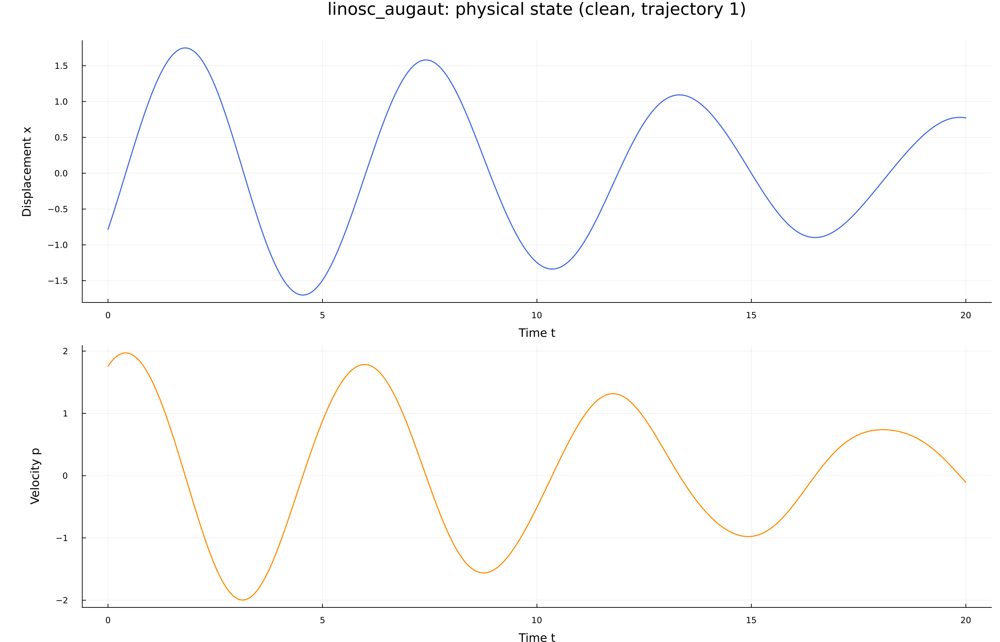

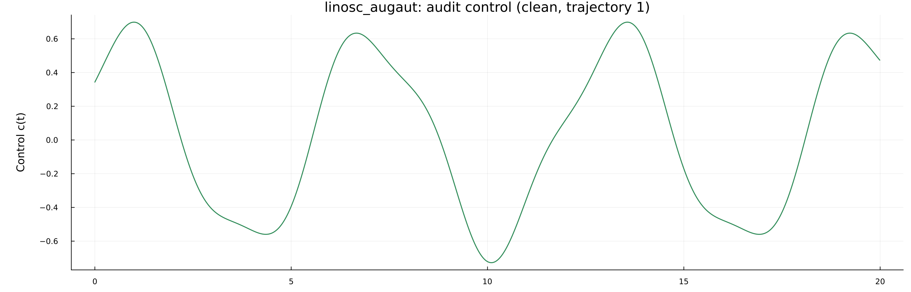

### `linosc_addc`

- 动力学底座：Linear damped oscillator。
- 控制语义：显式加性受控；图中的 $c(t)$ 是控制输入。
- 控制图纵轴：`Control c(t)`。
- 代表轨线：`trajectory_id = 1`，`split_id = train`，`matched_key = linosc:1:1`。

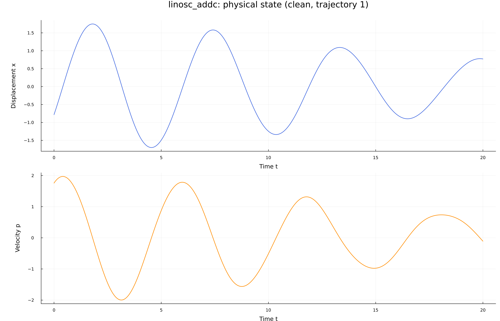

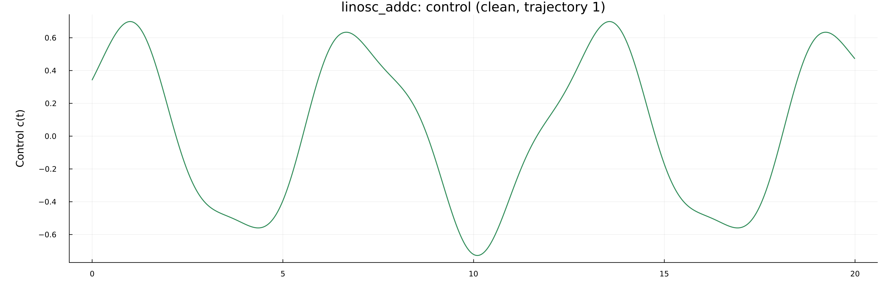

### `linosc_bilinc`

- 动力学底座：Linear damped oscillator。
- 控制语义：显式双线性受控；图中的 $c(t)$ 参与状态--控制相互作用。
- 控制图纵轴：`Control c(t)`。
- 代表轨线：`trajectory_id = 1`，`split_id = train`，`matched_key = linosc:1:1`。

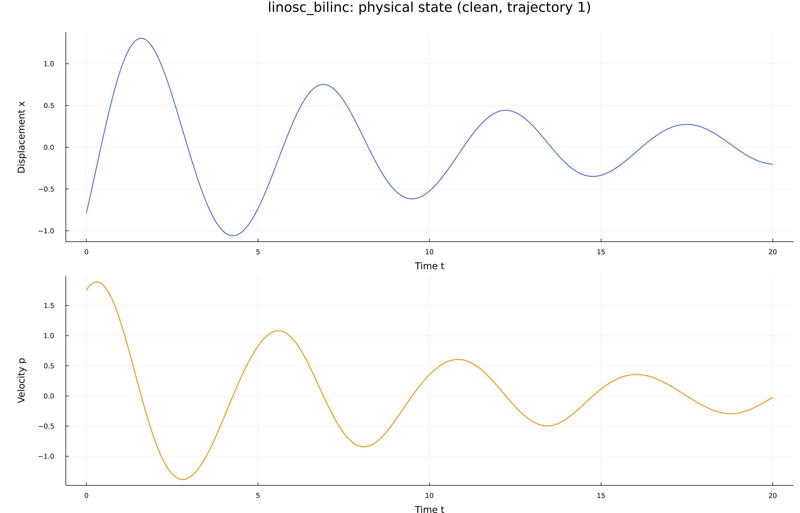

### `duffing_augaut`

- 动力学底座：Duffing oscillator。
- 控制语义：扩展自治；图中的 $c(t)$ 为保存的审计信号，不作为 learner 的独立输入。
- 控制图纵轴：`Control c(t)`。
- 代表轨线：`trajectory_id = 1`，`split_id = train`，`matched_key = duffing:1:1`。

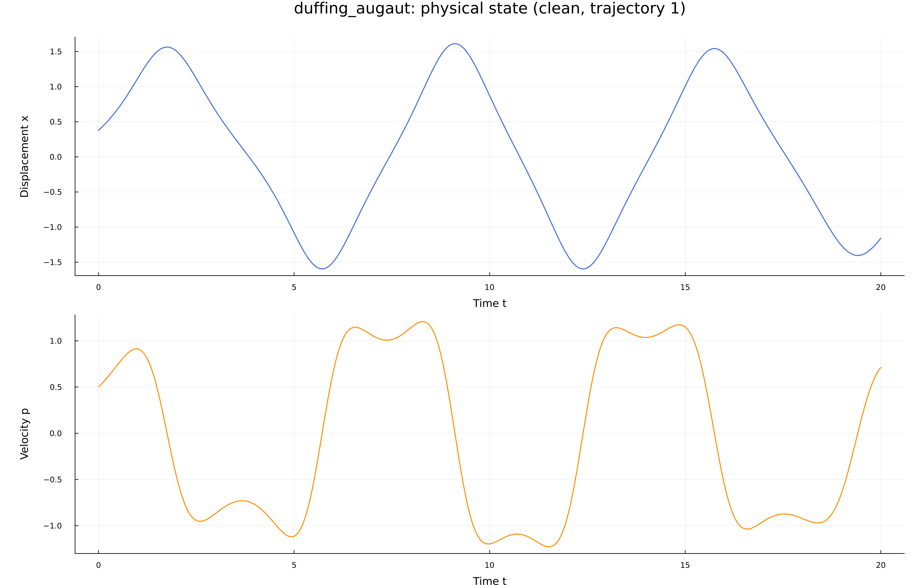

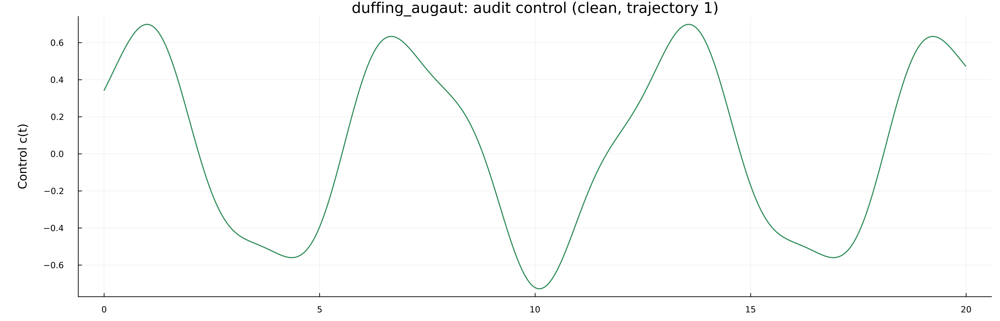

### `duffing_addc`

- 动力学底座：Duffing oscillator。
- 控制语义：显式加性受控；图中的 $c(t)$ 是控制输入。
- 控制图纵轴：`Control c(t)`。
- 代表轨线：`trajectory_id = 1`，`split_id = train`，`matched_key = duffing:1:1`。

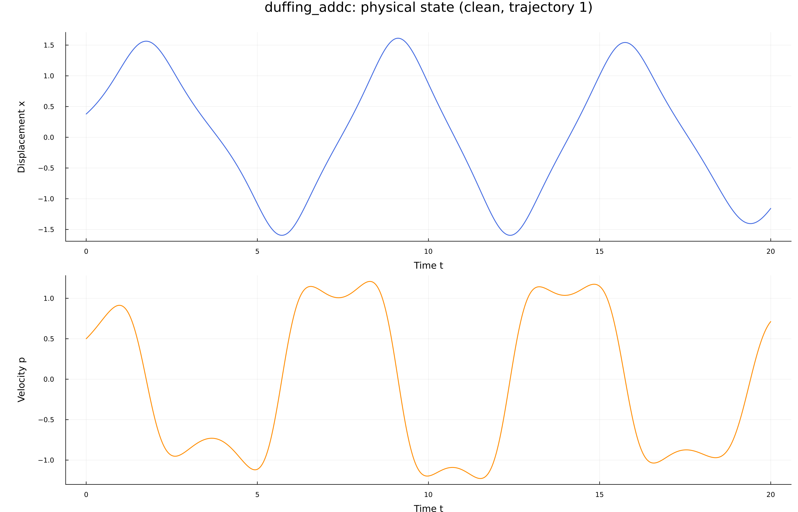

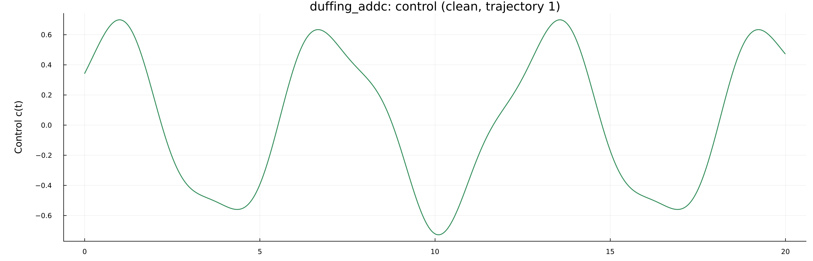

### `duffing_bilinc`

- 动力学底座：Duffing oscillator。
- 控制语义：显式双线性受控；图中的 $c(t)$ 参与状态--控制相互作用。
- 控制图纵轴：`Control c(t)`。
- 代表轨线：`trajectory_id = 1`，`split_id = train`，`matched_key = duffing:1:1`。

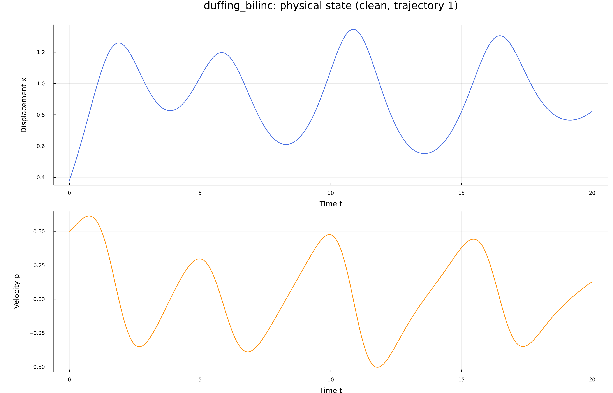

### `vdp_augaut`

- 动力学底座：Van der Pol oscillator。
- 控制语义：扩展自治；图中的 $c(t)$ 为保存的审计信号，不作为 learner 的独立输入。
- 控制图纵轴：`Control c(t)`。
- 代表轨线：`trajectory_id = 1`，`split_id = train`，`matched_key = vdp:1:1`。

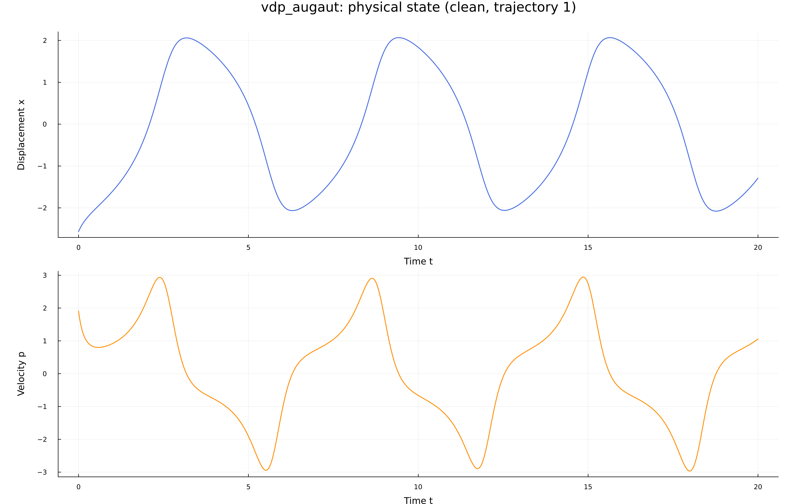

### `vdp_addc`

- 动力学底座：Van der Pol oscillator。
- 控制语义：显式加性受控；图中的 $c(t)$ 是控制输入。
- 控制图纵轴：`Control c(t)`。
- 代表轨线：`trajectory_id = 1`，`split_id = train`，`matched_key = vdp:1:1`。

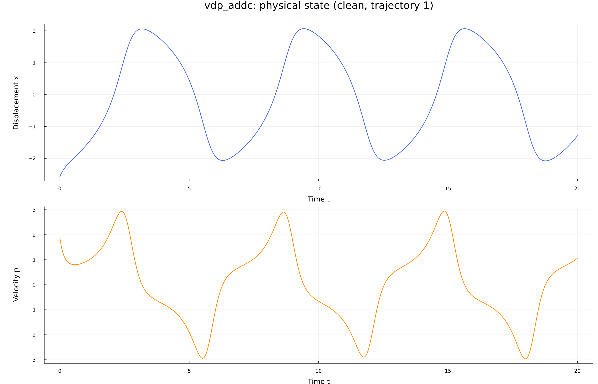

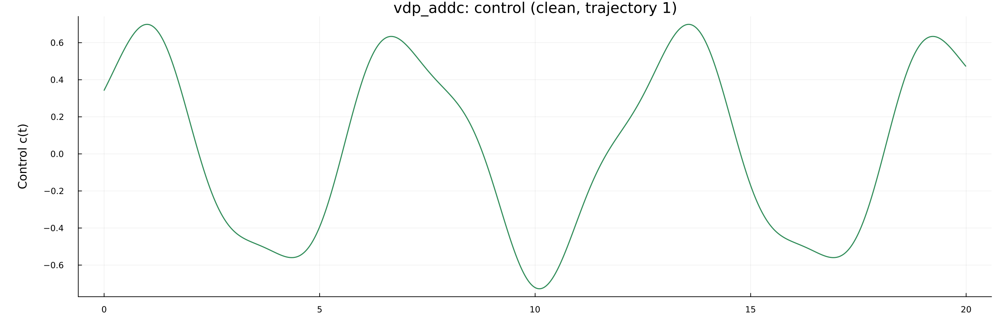

### `vdp_bilinc`

- 动力学底座：Van der Pol oscillator。
- 控制语义：显式双线性受控；图中的 $c(t)$ 参与状态--控制相互作用。
- 控制图纵轴：`Control c(t)`。
- 代表轨线：`trajectory_id = 1`，`split_id = train`，`matched_key = vdp:1:1`。

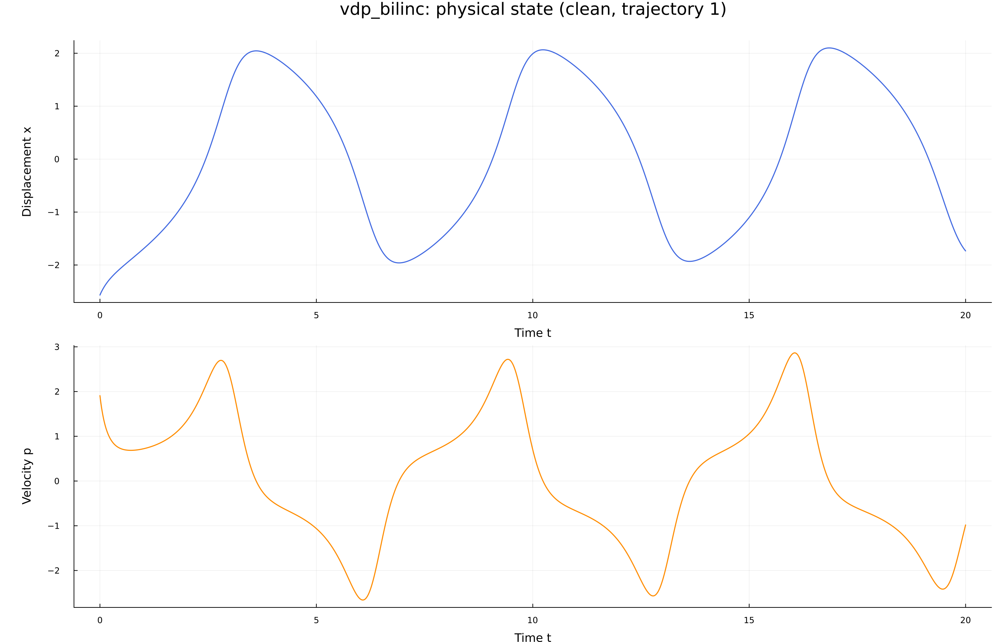

### `pendulum_augaut`

- 动力学底座：Controlled pendulum。
- 控制语义：扩展自治；图中的 $c(t)$ 为保存的审计信号，不作为 learner 的独立输入。
- 控制图纵轴：`Control c(t)`。
- 代表轨线：`trajectory_id = 1`，`split_id = train`，`matched_key = pendulum:1:1`。

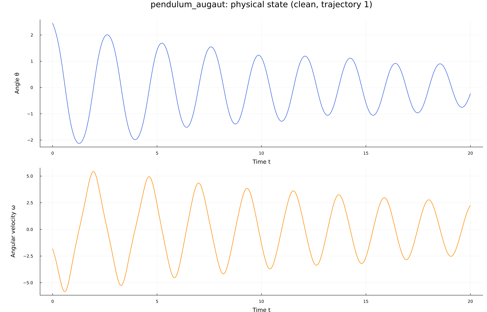

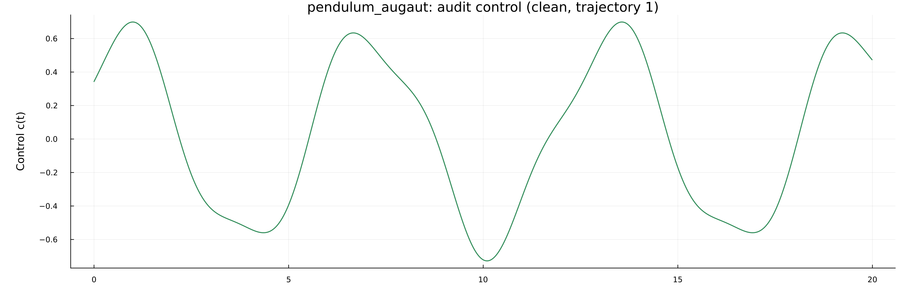

### `pendulum_addc`

- 动力学底座：Controlled pendulum。
- 控制语义：显式加性受控；图中的 $c(t)$ 是控制输入。
- 控制图纵轴：`Control c(t)`。
- 代表轨线：`trajectory_id = 1`，`split_id = train`，`matched_key = pendulum:1:1`。

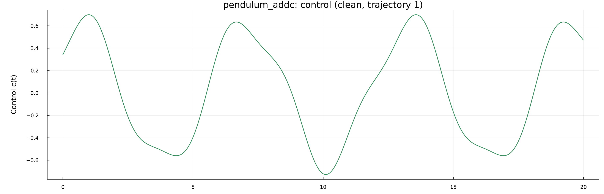

### `pendulum_bilinc`

- 动力学底座：Controlled pendulum。
- 控制语义：显式双线性受控；图中的 $c(t)$ 参与状态--控制相互作用。
- 控制图纵轴：`Control c(t)`。
- 代表轨线：`trajectory_id = 1`，`split_id = train`，`matched_key = pendulum:1:1`。

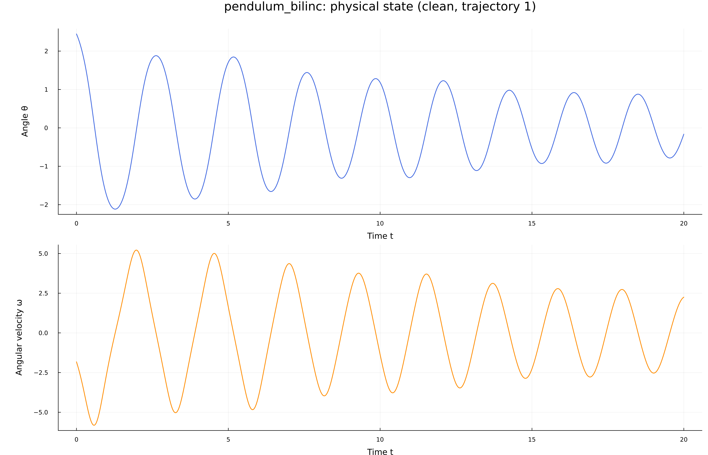

### `duffing_hf_augaut`

- 动力学底座：High-frequency strong-hardening Duffing oscillator。
- 控制语义：扩展自治；显示保存的物理外力 $u_{\mathrm{HF}}(t)$，仅用于审计，不作为 learner 的独立输入。
- 控制图纵轴：`Physical forcing u_HF(t)`。
- 代表轨线：`trajectory_id = 280`，`split_id = train`，`matched_key = duffing_hf:280`。

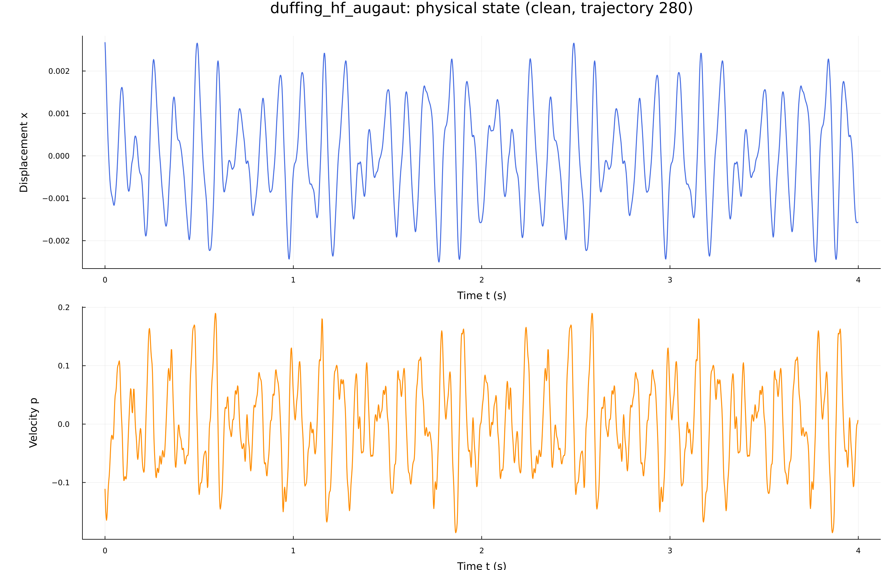

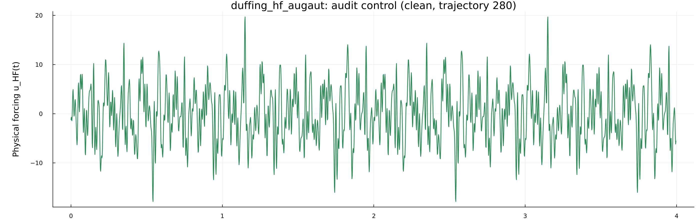

### `duffing_hf_addc`

- 动力学底座：High-frequency strong-hardening Duffing oscillator。
- 控制语义：显式加性受控；显示物理外力 $u_{\mathrm{HF}}(t)$。
- 控制图纵轴：`Physical forcing u_HF(t)`。
- 代表轨线：`trajectory_id = 280`，`split_id = train`，`matched_key = duffing_hf:280`。

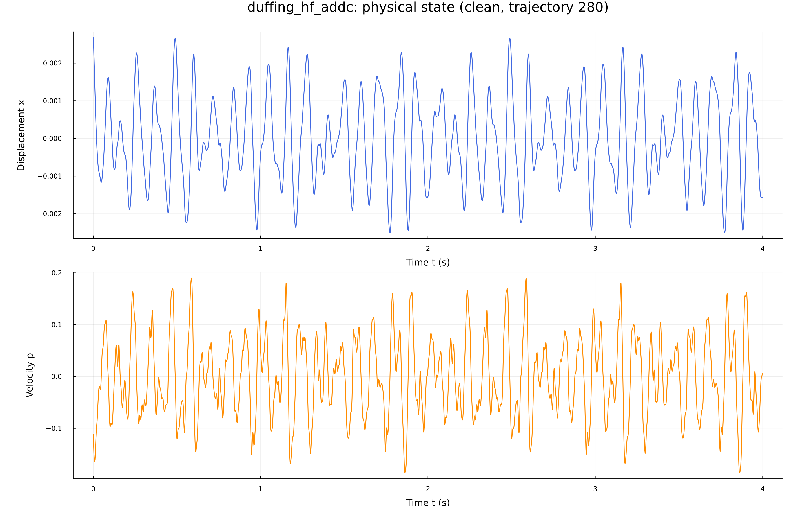

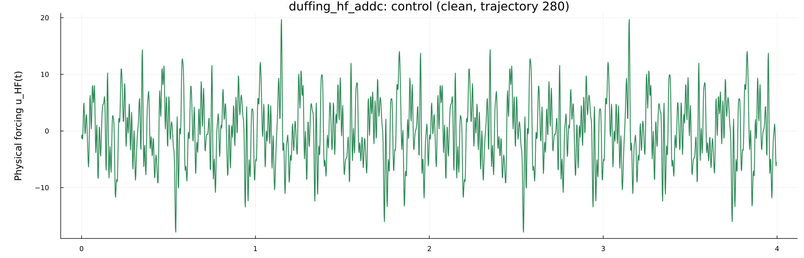

### `duffing_hf_bilinc`

- 动力学底座：High-frequency strong-hardening Duffing oscillator。
- 控制语义：强相对线性刚度调制 $k[1-\rho_k c_{\mathrm{HF}}(t)]$；显示单位峰值源 $c_{\mathrm{HF}}(t)$。
- 控制图纵轴：`Unit-peak source c_HF(t)`。
- 代表轨线：`trajectory_id = 280`，`split_id = train`，`matched_key = duffing_hf:280`。

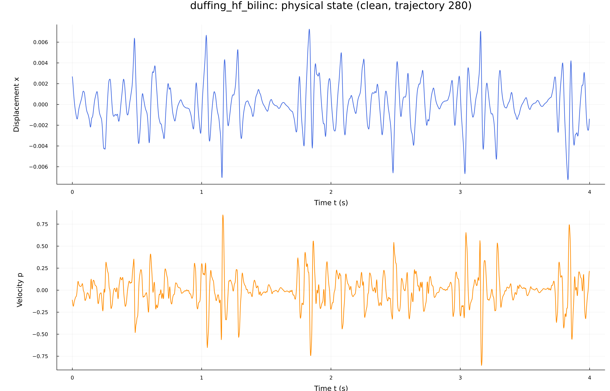

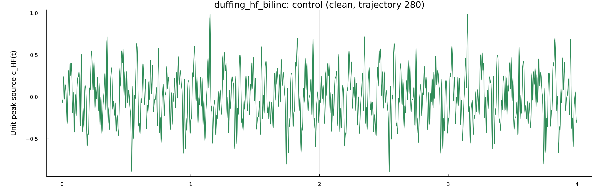

## 解读、限制与复现

三个角色必须分别解读：`augaut` 将外部源状态纳入自治 learner state，`addc` 为正式的显式加性控制接口，`bilinc` 则含有状态--控制相互作用。图中的控制曲线用于展示同一保存信号的时间变化，不能据此将三类对象当作同一控制律的重复样本。

这些图仅展示每个对象的一条训练轨线，因而不能代替 512 条轨迹上的分布、split、激励 Gram、零控制退化或控制灵敏度诊断。release metadata 中的这些正式生成诊断仍是数据集有效性的依据。

复现命令：`julia --project=. experiments/visualization/plot_controlled_lowdim_v1_trajectories.jl`。脚本、图像、摘要表和本报告位于同一任务目录下。
